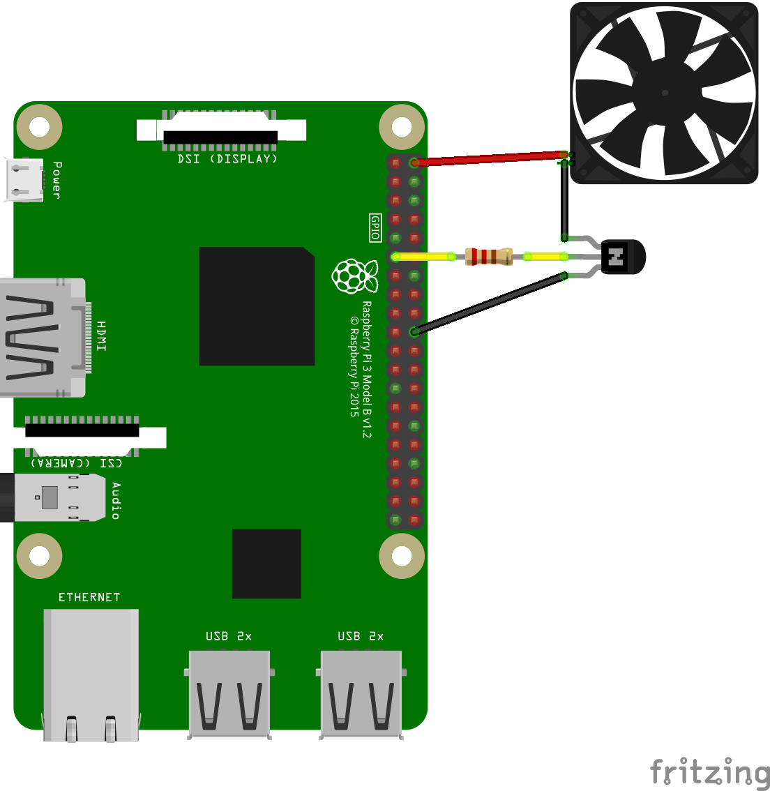

Pi Fan Controller
==============

# Overview

Turns on an external fan if CPU temperature exceeds a threshold. Turns fan off if the temperature falls below another threshold.

Polls temperature every few seconds.

Temperature thresholds are configuration using constants.

# Usage

## Hardware

* 1 x 2N2222 NPN Transistor
* 1 x 680Ω Resistor
* 1 x 0.2A 5V DC Brushless Fan




## Software

Configure constants in `main.py` to set appropriate GPIO pin and temperature thresholds. Then execute:

```
python3 main.py
```
