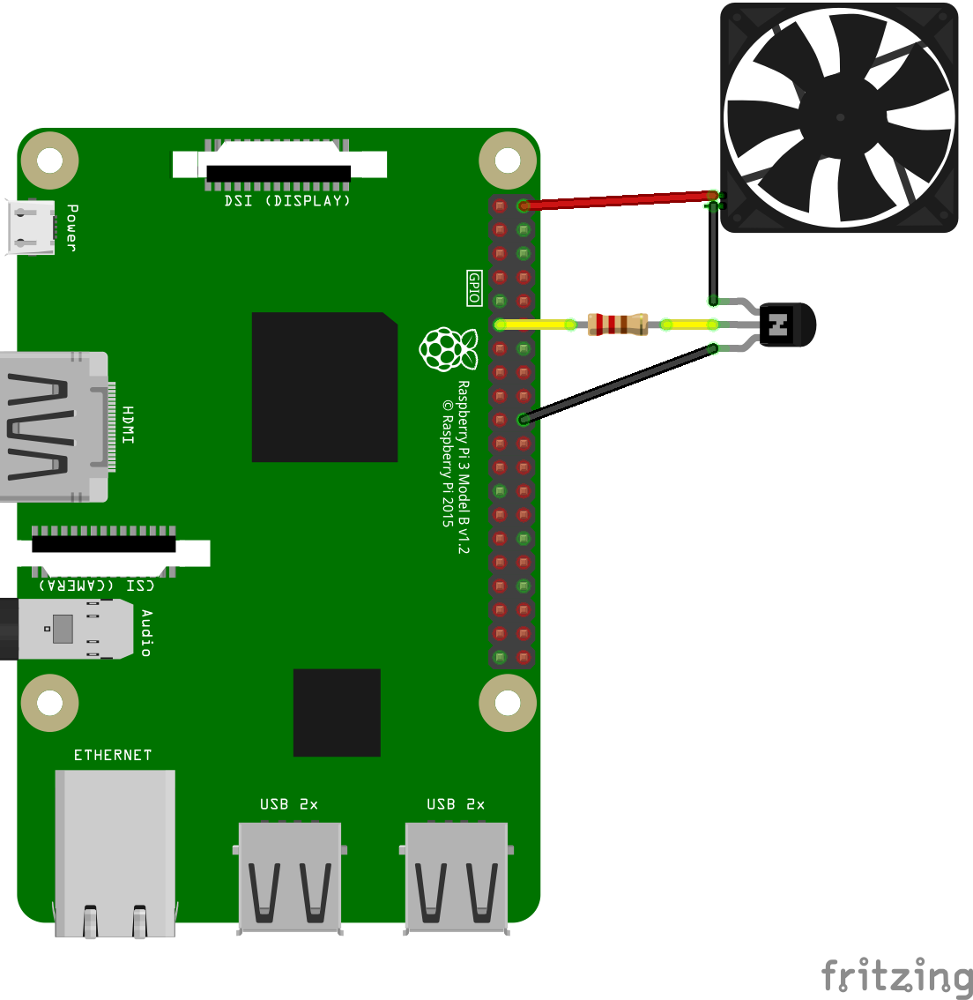

# Pi Fan Controller

Switches a small fan on and off by CPU temperature to keep a Raspberry Pi 4 cool.

There is no software to run. Raspberry Pi OS's kernel already includes a `gpio-fan`
driver, so the whole controller is one line in `config.txt`. This repository
documents the wiring and that line.

## How it works

```
dtoverlay=gpio-fan,gpiopin=17,temp=65000,hyst=15000
```

| Parameter      | Value | Meaning                                                  |
| -------------- | ----- | -------------------------------------------------------- |
| `gpiopin=17`   | 17    | BCM GPIO17 (physical pin 11) drives the fan transistor   |
| `temp=65000`   | 65 °C | Fan switches **on** at or above this temperature         |
| `hyst=15000`   | 15 °C | Fan switches **off** below `temp - hyst`, i.e. below 50 °C |

Values are in millidegrees Celsius. The kernel's thermal framework reads the CPU
temperature every 2 seconds. Once the fan is on, it stays on until the temperature
drops below the off threshold, so it does not flap around 65 °C.

## Hardware

* 1 x 2N2222 NPN transistor
* 1 x 680 Ω resistor
* 1 x 0.2 A 5 V DC brushless fan

| Connection                 | Raspberry Pi header   |
| -------------------------- | --------------------- |
| Fan red (+)                | Pin 2 (5V)            |
| Fan black (−)              | Transistor collector  |
| Transistor emitter         | Pin 20 (GND)          |
| Transistor base            | 680 Ω resistor, then pin 11 (GPIO17) |



The diagram is drawn on a Pi 3; the Pi 4 has the same 40-pin header, so the wiring
is identical. The Fritzing source is `circuit/pi-fan-controller.fzz`. Check your
transistor's datasheet, as the collector/base/emitter order differs between packages.

The base current is about (3.3 V − 0.7 V) / 680 Ω ≈ 3.8 mA, well inside the Pi's
per-pin GPIO limit. Brushless fans have their own drive electronics, so no flyback
diode is needed.

## Install

Requires Raspberry Pi OS with Linux kernel 5.15 or newer. Check with `uname -r`;
`dtoverlay -h gpio-fan` should list the `hyst` parameter.

1. Back up the boot config and add the overlay. On Raspberry Pi OS Bookworm or
   newer the file is `/boot/firmware/config.txt`; on older releases it is
   `/boot/config.txt`.

   ```shell
   sudo cp /boot/firmware/config.txt /boot/firmware/config.txt.bak
   printf '\n[all]\n# Fan on at 65C, off below 50C (GPIO17)\ndtoverlay=gpio-fan,gpiopin=17,temp=65000,hyst=15000\n' \
     | sudo tee -a /boot/firmware/config.txt
   ```

2. Reboot. The kernel now controls the fan from early in boot.

## Verify

```shell
# The overlay registered a fan cooling device
grep -l '^gpio-fan$' /sys/class/thermal/cooling_device*/type

# Trip point: temperature, hysteresis and type ("active")
grep -H . /sys/class/thermal/thermal_zone0/trip_point_*_{temp,hyst,type}

# Live view of CPU temperature and fan state (cur_state 1 = on, 0 = off)
watch -n 2 'awk "{printf \"cpu %.1f C\n\", \$1/1000}" /sys/class/thermal/thermal_zone0/temp; for d in /sys/class/thermal/cooling_device*; do echo "$(cat $d/type) cur_state=$(cat $d/cur_state)"; done'
```

To exercise the fan, load the CPU (`sudo apt install stress-ng`, then
`stress-ng --cpu 0 --timeout 10m`) and watch it switch on.

## Tune

Edit the `dtoverlay=gpio-fan` line and reboot. The off temperature is `temp - hyst`,
for example `temp=70000,hyst=15000` switches on at 70 °C and off below 55 °C. Keep
`hyst` at 5 °C or more to avoid rapid cycling. The Pi firmware also throttles the CPU
at about 80 °C, independently of the fan.

## Remove

Delete the `dtoverlay=gpio-fan` line (or restore `config.txt.bak`) and reboot.

## Limitations

The fan is on/off only, with no speed control. Settings apply at boot, so changing
them needs a reboot.

## References

* [`gpio-fan` overlay parameters](https://github.com/raspberrypi/linux/blob/rpi-6.12.y/arch/arm/boot/dts/overlays/README) (search for `gpio-fan`)
* [`gpio-fan-overlay.dts`](https://github.com/raspberrypi/linux/blob/rpi-6.12.y/arch/arm/boot/dts/overlays/gpio-fan-overlay.dts)
